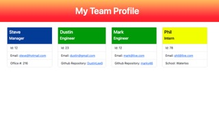

# Team Profile Generator
[](https://opensource.org/licenses/MIT)

The command-line application([Node.js](https://nodejs.org/dist/latest-v18.x/docs/api/)) allows users to generate a webpage displaying team members and information about their name, id, emails, github, school and/or office number depending on what role they occupy. The team members will be input by the user. There are three roles on the team: a manager, engineers, and interns. The app will generate a profile card with information about each team member and displays on the webpage. 

Here is a quick [video](https://drive.google.com/file/d/1IfhjB6EfOdUMSpBkLQqMu2cUm-dKMHuc/view) demonstrating the installation and calling the app. 

## Installation
Dependencies needed for the application: [Jest](https://www.npmjs.com/package/jest) for developer testing and the [Inquirer](https://www.npmjs.com/package/inquirer/v/8.2.4) package to collect user input.   

To install the dependencies, run:  
```
npm i
```

## Testing 
To run [Jest](https://www.npmjs.com/package/jest) tests, run:
```
npm test
```

## Usage
To invoke the app navigate to the corresponding directory then run:
```
node index
```
User will be prompted for information about the team manager then have the choice to add engineers and interns. Once all team members are added, a html webpage will be generated located in the dist folder. 


## License
This application is licensed under the [MIT License](https://opensource.org/licenses/MIT).

### Notes
New to using [Jest](https://www.npmjs.com/package/jest).